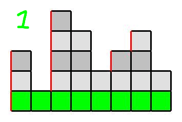

# [{frontMatter.title}](https://leetcode.com/problems/minimum-number-of-increments-on-subarrays-to-form-a-target-array)

import Tabs from "@theme/Tabs";
import TabItem from "@theme/TabItem";
import CodeBlock from "@theme/CodeBlock";
import DifficultyBadge from "@site/src/components/Badges/DifficultyBadge";
import Solution from "!!raw-loader!./solution.js";
import Description from "./_Description.md";
import Examples from "./_Examples.md";

<DifficultyBadge difficulty="Hard" />

<Tabs>
  <TabItem value="description" label="題目描述" default>
    <details open>
      <summary>Description</summary>
        <Description />
        <Examples />
    </details> 
  </TabItem>

  <TabItem value="solution" label="解答">
   ## Solution
    <CodeBlock language="js">{Solution}</CodeBlock>
  </TabItem>
</Tabs>

## 解題思路

可以把這題目想成疊積木，像這張從詳解偷來的圖所示（點圖片可以連到原討論串）　　
[](https://leetcode.com/problems/minimum-number-of-increments-on-subarrays-to-form-a-target-array/solutions/754682/wall-of-bricks-by-coder206-w0ok/)

這張圖是把 `[3, 1, 5, 4, 2, 3, 4, 2]` 轉換而成的圖，第一直排是 `3` 格高，第二是 `1`，以此類推  
而紅色的邊數量總數就是這題的答案  
因此可以先從最左邊的直排開始，先把初始值記錄起來

```js
let result = target[0];
```

也就是先處理第一個直排，轉換成圖片就會像這樣：  


而因為在完成第一直排的時候，最底下那排已經被一併完成了  
故第二層開始時可以不必從 0，可以從第一層開始  
且因第二直排是 `1`，故不必做任何事。
第三直排也同樣不必從 0 開始，可以從 `1` 開始疊  


第四、五直排因為完成三的同時已經被完成了故跳過

後面也同理，完整步驟會長這樣  


根據上面所式，如果新的直排比前一直排矮，代表他已經在疊前排時候被完成了，故可以跳過他  
轉換成程式碼就會變成

```js
for (let i = 1; i < target.length; i++) {
  // 從 1 開始是因為 target[0] 初始已被計算
  if (target[i] - target[i - 1] > 0) {
    // 如果 i 比前一排 i - 1 還小的話 result 不用增加，像第二排的 1 已經在上一步被完成了
    result += target[i] - target[i - 1];
    // 較大的話僅增加兩者的差異值
    // 如圖片 4 ~ 7 步驟是 1 , 5 的話增加 4，因為 1 已經在上一步先加上了
  }
}
```

最後遍歷完一遍就是答案了 !

```js
return result;
```

## 心得

謝謝 [Neetcode](https://youtu.be/84mt0YWJd1w?si=K2uBgHKPdhN05eMg) 解釋這題
